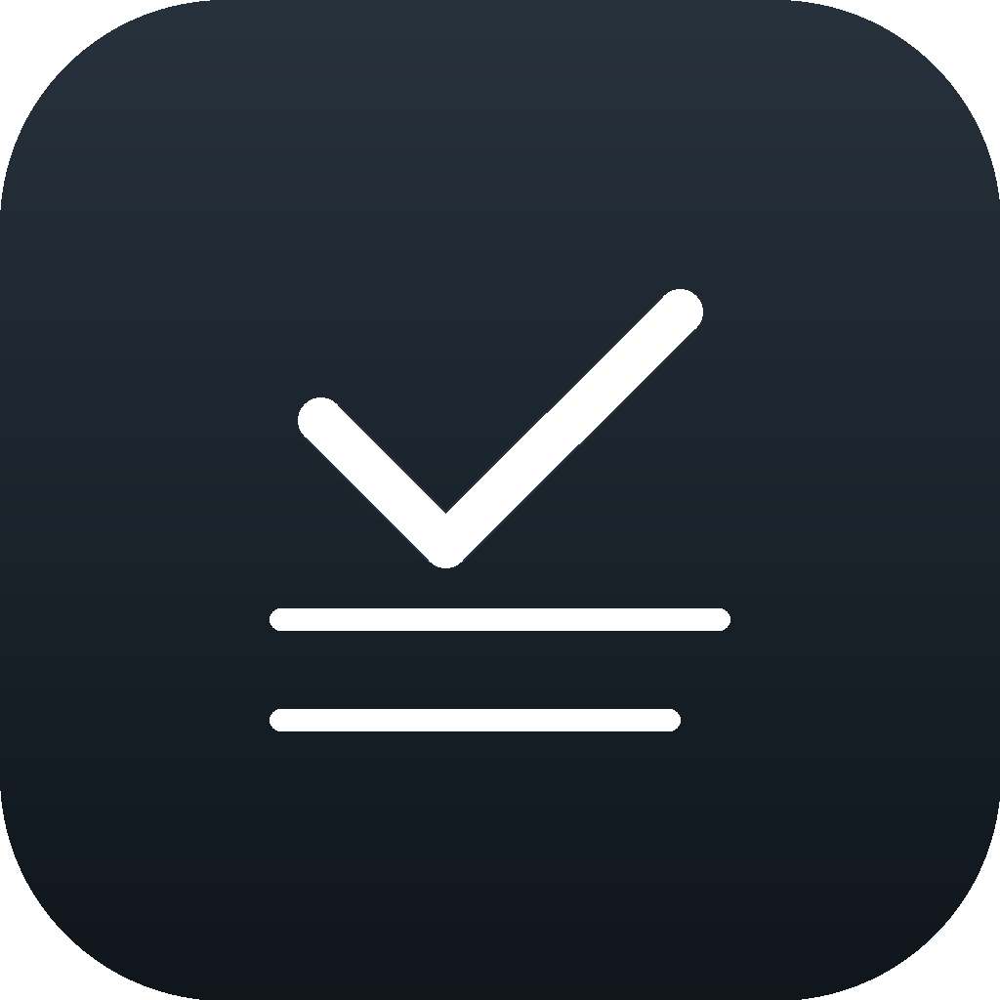

<p align="center">
  
</p>

<h1 align="center">Slate</h1>

<p align="center">
  <strong>极简、原生的 macOS 待办事项应用</strong>
  <br />
  纯本地 · 零依赖 · 键盘驱动 · 深色原生
</p>

<p align="center">
  
  
  
  
  <a href="https://github.com/thevipsong/slate/actions/workflows/ci.yml">
    
  </a>
</p>

---

## ✨ 核心亮点

- 🧩 **分组 + 筛选 + 搜索** — 多分组切换（创建/重命名/移动），支持全部 / 待完成 / 已完成 / 逾期四种筛选，⌘F 搜索标题即时过滤
- 📅 **轻量到期日** — 自定义深色日历面板，一行内标记「今天 / 昨天 / 逾期 / M-D」，逾期橙色警示，逾期筛选 + 统计卡一目了然
- ⌨️ **键盘驱动** — 几乎不需要鼠标：⌘N 新建、⌘↩ 添加、⌘Z 撤销、⌘⇧↩ 切换完成、⌘⌫ 删除、Esc 取消编辑、⌘1-3 切换筛选、⌘[ ] 切分组、⌘F 搜索
- ✨ **严格单选 + 拖拽** — 单击任务立即选中且始终只保留一条高亮；支持同组内拖拽排序，并可通过右键菜单移动到其他分组
- 🔙 **多步撤销** — 增加 / 删除 / 完成 / 编辑 / 移动全覆盖，撤销栈上限可配
- 🏠 **纯本地 JSON 存储** — 零后台、零上传、零隐私泄露。原子写入 + 双代备份 + 损坏自动回退 + 版本迁移链（v1→v2→v3）
- 🌤️ **天气 + 每日名言** — 8 个城市可选天气（当前温度 + 图标），每日一句中文名言，Header 一行展示，不打扰
- 🎨 **可配置主题** — 深色 / 浅色 / 跟随系统；Rounded / Sans Serif / Monospaced 三种字体；字号可调
- 🧱 **零外部依赖** — 纯 SwiftUI + MVVM，Package.swift 没有一行 `.package(url:)`。编译链极短，构建秒级
- 🧪 **52 个单元测试** — 覆盖 CRUD / 筛选 / 分组 / 拖拽 / 撤销 / 选择状态 / 并发 / 持久化往返 / 边界（空态、最大撤销栈、跨组拒绝、空白编辑、最后分组删除拒绝）

---

## 🚀 快速开始

### 系统要求

- macOS 15.0 (Sequoia) 或更高版本
- Swift 6.0+（Xcode 16+ 或仅 Command Line Tools）

### 安装与运行

```bash
# 克隆仓库
git clone https://github.com/thevipsong/slate.git
cd slate

# 开发模式运行
swift run TodoList

# 或使用 Xcode
# File → Open → 选择 Package.swift → 选择 My Mac → Run
```

### 打包本机 App

```bash
# 生成 Slate.app（含临时自签名）
./Scripts/build-app.sh

# 打开
open Dist/Slate.app
```

> 产物位于 `Dist/Slate.app`，可直接拖入 Applications 文件夹。脚本使用临时签名，
> 适合本机开发和测试；面向其他用户发布前需使用 Developer ID 签名并完成 Apple 公证。

### 运行测试

```bash
# 通过项目脚本（兼容仅有 CLT 的环境）
./Scripts/run-tests.sh

# 或通过 SwiftPM（需要完整 Xcode）
swift test
```

---

## 📁 目录结构

```
Slate/
├── Sources/
│   └── TodoList/
│       ├── App/
│       │   └── TodoListApp.swift         # 应用入口 + 命令菜单（撤销/搜索/新建）
│       ├── Models/
│       │   ├── TodoItem.swift            # 任务模型（含到期日）
│       │   ├── TodoGroup.swift           # 分组模型
│       │   └── TodoFilter.swift          # 筛选枚举（全部/待完成/已完成/逾期）
│       ├── ViewModels/
│       │   └── TodoViewModel.swift       # 核心逻辑：CRUD / 筛选 / 搜索 / 撤销 / 选择状态
│       ├── Views/
│       │   ├── ContentView.swift         # 布局容器
│       │   ├── HeaderView.swift          # 顶部：天气 + 名言 + 统计卡
│       │   ├── FilterBar.swift           # 筛选 chip + 搜索框
│       │   ├── GroupBar.swift            # 分组选项卡
│       │   ├── TodoListView.swift        # 任务列表 + 空状态
│       │   ├── TodoRowView.swift         # 单行任务（含到期日 chip）
│       │   ├── TodoInputView.swift       # 底栏输入区 + 日历按钮
│       │   ├── CalendarPickerView.swift  # 自定义深色日历面板
│       │   ├── BulkActionBar.swift       # 批量操作栏
│       │   ├── AppTheme.swift            # 主题 / 字体 / 天气城市配置
│       │   └── AppColors.swift           # 全局色板
│       └── Services/
│           ├── TodoFileStore.swift       # JSON 读写：原子写 / 双备份 / 版本迁移
│           ├── WeatherService.swift      # 天气获取 + 每日名言
│           └── TodoReminderService.swift # 本地提醒
├── Tests/
│   └── TodoListTests/
│       ├── TodoViewModelTests.swift      # 视图模型测试
│       ├── TodoFileStoreTests.swift      # 存储层测试
│       ├── WeatherServiceTests.swift     # 天气 / 名言测试
│       └── TodoReminderServiceTests.swift # 提醒服务测试
├── Scripts/
│   ├── build-app.sh                      # Release 打包脚本
│   └── run-tests.sh                      # CLT 兼容测试脚本
├── Resources/
│   └── AppIcon.icns                      # App 图标
├── .github/
│   ├── workflows/ci.yml                  # GitHub Actions 持续集成
│   ├── ISSUE_TEMPLATE/                   # Bug / 功能建议模板
│   └── pull_request_template.md          # Pull Request 检查清单
├── Dist/                                 # 打包产物 (gitignored)
├── CHANGELOG.md                          # 版本变更记录
├── CONTRIBUTING.md                       # 贡献指南
├── SECURITY.md                           # 安全问题报告方式
├── Package.swift
└── README.md
```

---

## 🗺️ Roadmap

- [x] 分组管理 + 四种筛选
- [x] 搜索（⌘F 即时过滤）
- [x] 轻量到期日 + 自定义日历面板
- [x] 天气面板（可配置城市）
- [x] 每日中文名言
- [x] 主题 / 字体 / 字号可配置
- [x] 多步撤销
- [x] 严格单选
- [x] 同组拖拽排序 + 右键跨组移动
- [x] 纯本地 JSON 存储（原子写 + 备份 + 迁移）
- [x] 52 个单元测试
- [x] 到期日本地通知提醒
- [ ] iCloud 同步（或在偏好中可选）
- [ ] 从 Things 3 / 提醒事项导入
- [ ] 标签系统
- [ ] 窗口常驻置顶 / 菜单栏迷你模式
- [ ] 自定义快捷键

---

## 🤝 Contributing

欢迎 Issue 和 Pull Request。完整的开发流程、代码规范和提交检查清单请参阅
[CONTRIBUTING.md](CONTRIBUTING.md)。

1. Fork 本仓库
2. 创建 Feature 分支 (`git checkout -b feature/amazing-idea`)
3. 提交你的改动 (`git commit -m 'feat: add amazing idea'`)
4. 推送到分支 (`git push origin feature/amazing-idea`)
5. 创建 Pull Request

提交前请运行测试确保通过：

```bash
./Scripts/run-tests.sh
```

---

## 🔐 Security

请不要在公开 Issue 中披露安全漏洞或包含私人待办数据的截图。安全问题请按照
[SECURITY.md](SECURITY.md) 中的方式私下报告。

---

## 📄 License

MIT © [thevipsong](https://github.com/thevipsong)

---

<p align="center">
  <sub>Built with SwiftUI. No Electron. No bloat.</sub>
</p>
